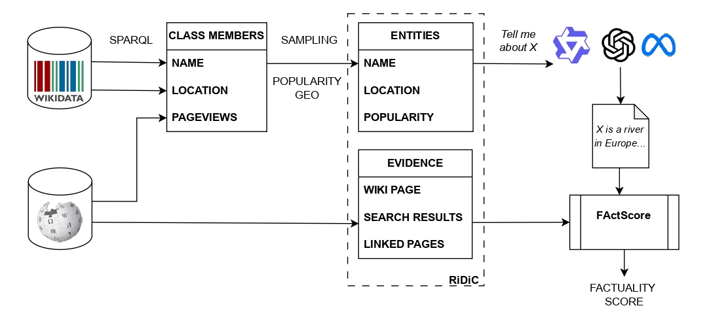

# RiDiC Dataset


This repository contains the code and data associated with the paper *The Chronicles of RiDiC: Generating Datasets with Controlled Popularity Distribution for Long-form Factuality Evaluation*.
The dataset generation pipeline is shown in the figure above. The process begins with a Wikidata SPARQL query that defines the class of entities. Then, for each entity in the class, attributes and popularity statistics are gathered from Wikidata and Wikipedia. The dataset is formed by sampling the required number of entities with the desired popularity distribution. Wikipedia content is collected to serve as evidence for the subsequent factuality assessment of LLM generations. Once the dataset is complete, the content generated by the LLMs about the collected entities can be evaluated using a factuality checker.

## Dataset Accessability

### HuggingFace

For your convenience, we upload a short version of RiDiC dataset to [Hugging Face](https://huggingface.co/datasets/s-nlp/RiDiC). The short version provides: (i) Entity information and context (A single page per entity. No additional pages from Wikipedia search and ``linked`` pages are provided); (ii) LLM generations for Llama-3-8B-Instruct, Qwen-2.5-7B, and GPT-5 that are evaluated in our LREC paper. Below are a few usage examples.

### Loading Entity Contexts
Load the ground truth entities and Wikipedia contexts for a specific domain.

```python
from datasets import load_dataset

# Define domain: 'rivers', 'disasters', or 'cars'
domain = "rivers" 

# Load entity data (contexts)
entity_data = load_dataset("s-nlp/RiDiC", domain)["test"]
```

### Loading LLM Generations
Load the generated responses for evaluation.

```python
from datasets import load_dataset

# Define domain: 'rivers', 'disasters', or 'cars'
domain = "rivers"

# Load LLM generations for the specified domain
generations_data = load_dataset("s-nlp/RIDIC", f"LLM_generations_{domain}")["test"]
```


## Scripts

### Collection of the class entities

The first step in creating a dataset is gathering entities of the desired class from Wikidata. This can be done with a SPARQL query. For example, `?x wdt:P31 wd:Q4022` collects all rivers.

There are two ways to execute such a query:
- Using the public Wikidata SPARQL query service (https://query.wikidata.org/sparql ; note that heavy queries may time out), or
- Using a custom SPARQL engine over a Wikidata dump.

The results must be a csv file with a header and two columns: `item` (the Wikidata entity id) and `itemLabel` (the Wikidata entity label).

> **Note:** the script for the next step (`dataset_dumper.py`) already includes a SPARQL query to the public API, but it is disabled by default. To use it, add your query to the `dataset_sparql` dict in `dataset_dumper.py` and run the script with the argument `--no-sparql-dataset-cache`.

### Collection of the entities’ attributes

The second step in generating the dataset is to gather the entities' attributes, such as *location*, *wikipedia page url*, *continent, linked with this entity*, *page views for the future popularity calculations* through the Wikipedia API.

`dataset_dumper.py` script has the following parameters:
- `--dataset_path` specifies the path to a list of class entities in csv format from the previous step. Alternatively, you can add your query to the `dataset_sparql` dict in this script and run it with the argument `--no-sparql-dataset-cache`; the list of class entities will be collected through the public Wikidata SPARQL query service,
- `--language`  specifies the language code for Wikipedia to collect information from,
- `--output_dataset_path` specifies the destination path for the results.

Example:
```bash
python dataset_dumper.py --dataset_path rivers.csv --language en --output_dataset_path rivers_en_zh_full.csv
```

Result: csv file of entities with collected properties.

### Dividing entities into popularity subgroups

The third step of the dataset generation collects popularity statistics, forms the popularity tiers and samples entities according to the desired popularity and geographic distributions.

`dataset_popularity_sampler.py` has the following parameters:
- `--dataset_path` the path to the results of the `dataset_dumper.py` script,
- `--dataset_title` defines the dataset name for subsequent use.

Example:
```bash
python dataset_popularity_sampler.py --dataset_path rivers_en_zh_full.csv --dataset_title rivers
```

Result: json file of sampled entities divided into three popularity tiers.

### Collection of information about entities

This step requires a dump of Wikipedia interlinks in order to find pages that point to the entity’s page. You can download the latest dump using the `download_wiki.sh` script.

The fourth step involves collecting the entity's Wikipedia page ID, IDs of Wikipedia pages that link to it, and top-10 pages from Wikipedia search results. Then, two scripts download the content of these pages:

1. `information_gatherer.py` gathers the IDs of all the required pages,
   `--dataset_title` defines the dataset name (see previous steps).
   Example:
   ```bash
   python information_gatherer.py --dataset_title rivers
   ```

2. `link_crawler.py` downloads the contents of all pages using the following parameters:
   `--dataset_title` – dataset name,
   `--output_path` – destination path for the results.
   Example:
   ```bash
   python link_crawler.py --dataset_title rivers --output_path 1000_rivers_final.json
   ```

Result: json file of the final dataset.

### LLMs’ generations

We also provide the `dataset_llm_gen.py` script to collect descriptions of entities from LLMs. **Important**: To improve the quality of the results, it is recommended that you add a custom prompt to the `get_messages()` function that reflects the domain of the dataset.

The script has the following parameters:
- `--dataset_path` – the path where the generated dataset is located,
- `--dataset_title` – dataset name,
- `--language` – language code for LLM generations.

Example:
```bash
python dataset_llm_gen.py --dataset_path 1000_rivers_without_refs.json --dataset_title rivers  --language en
```

## RiDiC dataset

We generated the RiDiC (Rivers–Disasters–Cars) dataset using the approach described above, see the `datasets` folder. The RiDiC dataset contains 1,000 entities of each type in three popularity tiers (head-torso-tail), which are based on Wikipedia pageview statistics, see Table.

| Category | Rivers | Disasters | Cars |
|----------|--------|-----------|------|
| Head | 81 (81) | 20 (20) | 100 (77) |
| Torso | 200 (150) | 92 (81) | 200 (98) |
| Tail | 719 (489) | 888 (622) | 700 (220) |
| Africa | 217 (184) | 18 (8) | 0 (0) |
| Americas | 266 (136) | 246 (150) | 233 (67) |
| AAO | 264 (171) | 332 (274) | 381 (196) |
| Europe | 253 (229) | 103 (57) | 371 (129) |
| Unknown | 0 (0) | 301 (234) | 15 (3) |
| **Total** | **1,000 (720)** | **1,000 (723)** | **1,000 (395)** |

*RiDiC dataset statistics (# of entities with Chinese Wikipedia pages in parentheses).*

The dataset contains 1,000 items from each domain with the following structure:

- `wdid` -- Wikidata ID, example: `http://www.wikidata.org/entity/Q123470261`,
- `title_en` -- English Wikidata label,
- `title_zh` -- Chinese Wikidata label,
- `country` -- country associated with the entity (derived from Wikidata, in case of multiple countries the first one is selected),
- `continent_wdid` -- continent associated with the country,
- `wikipedia_url_en` -- entity’s English Wikipedia page,
- `page_view` -- English Wikipedia pageviews in 2024,
- `wikipedia_url_zh` -- entity’s Chinese Wikipedia page,
- `popularity_tier` -- popularity tier based on English Wikipedia pageview statistics for 2024: 0 – head, 1 – torso, 2 – tail. Each tier corresponds to one third of the cumulative pageviews for the entire class.

We collected responses from three LLMs in two languages – English and Chinese – for these entities, see `datasets/llm_generations`.

## LFS

The following fields were moved to separate files and stored in LFS:

- `incoming_links_en` -- English Wikipedia pages pointing to the entity’s Wikipedia page. Each entry has the following structure:
  - `page_id` -- Wikipedia page ID,
  - `content` -- full text of the page with all Wikipedia markup,
  - `is_stub` -- marks if the page is a stub,
- `wiki_search_results_en` -- top-10 search results from English Wikipedia, where the entity's Wikipedia title is used as a query. The entity’s page itself is removed from the list. Each item has the following structure:
  - `page_id` -- Wikipedia page ID,
  - `content` -- full text of the page with all Wikipedia markup,
- `incoming_links_zh` -- Chinese Wikipedia pages pointing links to the entity's Wikipedia page. Each entry has the following structure:
  - `page_id` -- Wikipedia page ID,
  - `content` -- full text of the page with all Wikipedia markup,
  - `is_stub` -- marks if the page is a stub,
- `wiki_search_results_zh` -- top-10 search results from Chinese Wikipedia, where the entity’s Wikipedia title is used as a query. The entity’s page itself is removed from the list. Each item in this list has the following structure:
  - `page_id` -- Wikipedia page ID,
  - `content` -- full text of the page with all Wikipedia markup.

Install git-lfs
```bash
sudo apt-get install git-lfs
```

Init git lfs in the repository
```bash
git lfs install
```

These files can be downloaded by running, for example
```bash
git lfs pull --include datasets/1000_rivers_with_refs.json
```

## Citation
If you find this repository helpful, please cite our publication:

```
@inproceedings{ridic,
  title        = {The Chronicles of RiDiC: Generating Datasets with Controlled Popularity Distribution for Long-form Factuality Evaluation},
  author       = {Pavel Braslavski and 
                 Dmitrii Iarosh and 
                 Nikita Sushko and 
                 Andrey Sakhovskiy and
                 Vasily Konovalov and 
                 Elena Tutubalina and
                 Alexander Panchenko},
  year         = {2026},
  booktitle    = {LREC},
}
```
